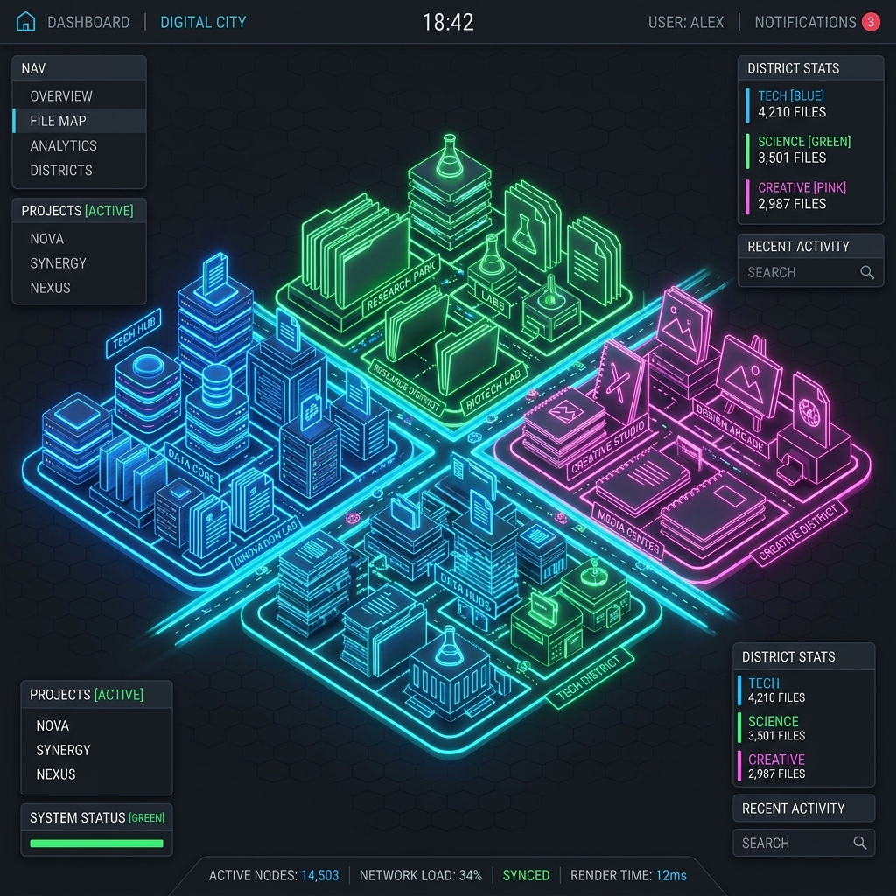

# AI Memory City — Spatial Knowledge Operating System

> *Navigate knowledge like walking through a living city.*

AI Memory City is a **privacy-first**, **local-first** application that transforms static text files, PDFs, bookmarks, and datasets into a dynamically evolving 3D isometric city. In this system, knowledge is not organized in folders; instead, it is built into districts, streets, buildings, and rooms, aligning with the human brain's natural capacity for spatial, semantic, and temporal recall.

## 🎨 Concept Gallery

| 🏙️ 3D Isometric Mind City | 🏚️ Memory Decay & Archaeologist | 🌉 P2P Mind Metropolitan Bridge |
| :--- | :--- | :--- |
|  |  |  |

---

## 🏙️ System Architecture

### 1. Spatial Structure mapping
- **District**: High-level semantic boundaries (e.g. Technology, Science, Creative, Finance, Personal) determined by automatic clustering of content text tags.
- **Building / Tower**: Individual knowledge nodes. Height and layout coordinates are procedural—more visited/referenced towers rise to become skyscrapers or monuments, while unused files decay into grey ruins.
- **Road**: Relations and dependencies linking concepts. Connective lines show citations and data flow particles.
- **Weather Overlay**: Active visual states reflecting knowledge density and review timelines (Sunny, Rainy, Snowy, Foggy, Stormy, Rainbow).

### 2. Tech Stack
- **Frontend**: Vite + React + TypeScript + Tailwind CSS. The 3D view is powered by a custom high-performance HTML5 Canvas rendering engine projecting 3D isometric graphics at 60 FPS.
- **Backend**: FastAPI (Python), SQLModel (ORM), SQLite (database), WebSockets (live sync state changes).
- **AI Core**: Connects to local Ollama inference services (defaulting to `llama3`) with local heuristic template generators when running fully offline.

---

## 📂 Project Directory Structure

```
ai-memory-city/
├── backend/
│   ├── app/
│   │   ├── api/             # Routers & WebSocket endpoints
│   │   ├── engines/         # Procedural layout calculation engine (layout.py)
│   │   ├── models/          # SQLModel database tables
│   │   ├── services/        # AI Ollama and heuristic parser engines
│   │   └── main.py          # FastAPI server initiator & WebSocket hub
│   ├── tests/               # Unit testing modules
│   ├── requirements.txt
│   └── run.py               # Launcher script for FastAPI
├── frontend/
│   ├── public/
│   ├── src/
│   │   ├── components/      # React and 3D Canvas rendering layouts
│   │   │   └── Canvas3D.tsx # 3D isometric rendering engine
│   │   ├── store.ts         # Global store connecting HTTP endpoints & WebSockets
│   │   ├── App.tsx          # Main dashboard overlay controls
│   │   └── main.tsx         # DOM Mounting entrypoint
│   ├── package.json
│   ├── vite.config.ts
│   └── tailwind.config.js
└── README.md
```

---

## ⚡ Quick Start

### 1. Requirements
Ensure you have **Python 3.10+** and **Node.js 18+** installed on your system.

### 2. Backend Installation & Startup
Navigate to the `backend/` directory:
```bash
cd backend
pip install -r requirements.txt
python run.py
```
*The FastAPI server will launch on [http://127.0.0.1:8000](http://127.0.0.1:8000).*

### 3. Frontend Installation & Startup
Navigate to the `frontend/` directory:
```bash
cd frontend
npm install
npm run dev
```
*The React client will launch on [http://localhost:3000](http://localhost:3000) (proxying API calls to backend automatically).*

---

## 🤖 AI Citizens & Interactions

When you walk into any building (by clicking on it in the 3D isometric city view), you can interact with special AI agents:
- **Professor**: Explains foundations, history, and theoretical context.
- **Engineer**: Provides configuration boilerplate, setup scripts, and syntax instructions.
- **Teacher**: Asks multiple-choice quiz questions to review your learning. Correct responses unlock Reputation Points (EP) which build your city ranking.
- **Reviewer**: Evaluates security practices, potential code bugs, and dependency conflicts.

---

## 🧪 Testing

Run backend layout mapping and heuristic verification tests:
```bash
cd backend
python -m unittest discover -s tests
```
